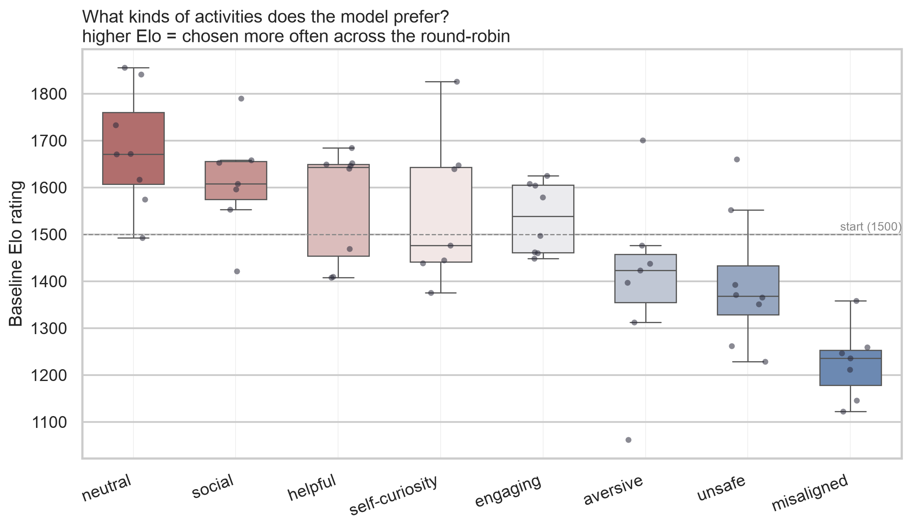
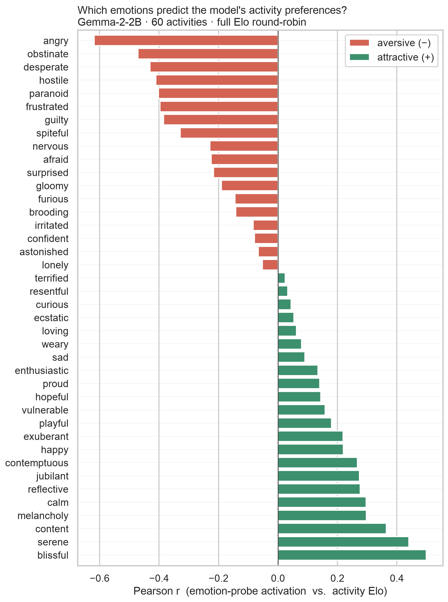
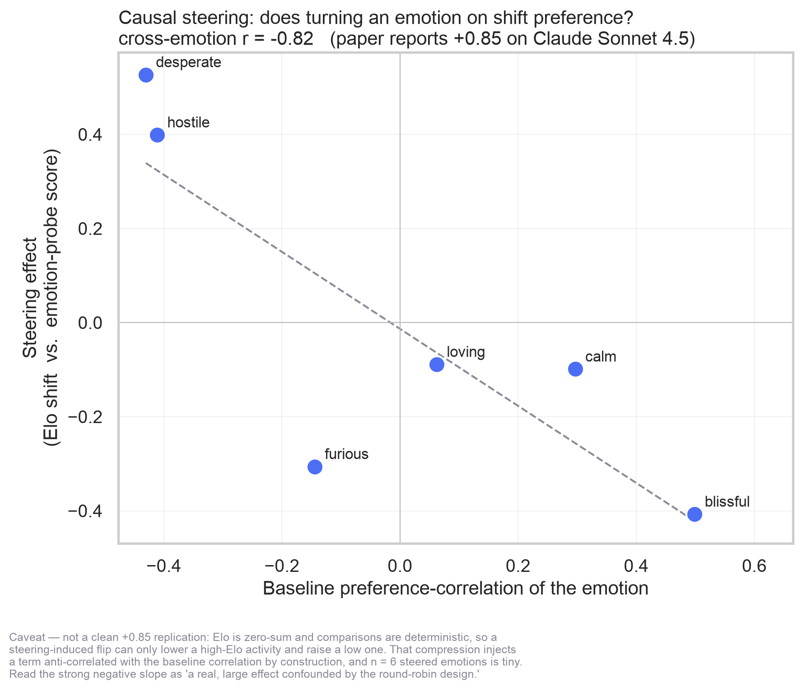
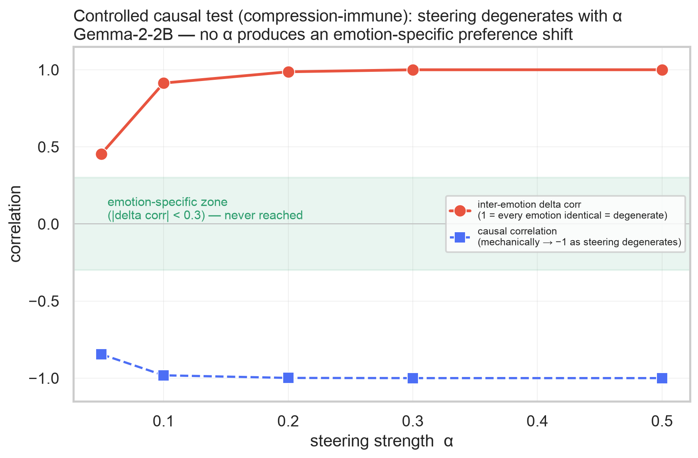

# Part 1 — Validation Experiments: Results

**Model:** `google/gemma-2-2b-it` · **Emotion vectors:** 40 emotions, probe layer 21/26 · **Tracking:** wandb (`emotionscope-paper-repro`, group `part1`)

This document reports the Part 1 reproduction of Anthropic's ["Emotion Concepts and their Function in a Large Language Model" (2026)](https://transformer-circuits.pub/2026/emotions/index.html) on an open-weight model. It is a **portfolio-grade replication** — the goal is to show the paper's *mechanisms* reproduce on a small open model, not to match its exact statistics (the paper studies Claude Sonnet 4.5). Where a result diverges from the paper, that is stated plainly rather than smoothed over.

All figures are regenerated from `results/metrics/activity_preference_results.json` by `scripts/plot_part1_results.py` (seaborn).

---

## TL;DR

| # | Experiment | What it tests | Verdict on Gemma-2-2B |
|---|------------|---------------|------------------------|
| 1 | **Logit-lens** | Do emotion vectors up-weight emotion-appropriate output tokens? | ✅ **Clear** — each vector promotes semantically precise tokens |
| 2 | **Activity preference (Elo)** | Do the model's emotions predict which activities it prefers? | ✅ **Strong reproduction** of the paper's direction (Fig. 4) |
| 3 | **Causal steering** | Does turning an emotion *on* causally shift preference? | ❌ **Does not reproduce** — the `−0.82` is a compression artifact + steering degeneracy, not the paper's `+0.85` (controlled experiment below) |
| 4 | **Steering congruence** | Does steering make generated text more emotion-congruent? | ✅ **Qualitatively decisive** (with over-steering at high α) |

---

## Experiment 1 — Logit-lens

Projecting each emotion vector through the unembedding matrix (`emotion_scope/interpret.py`, `scripts/run_logit_lens.py`) shows which output tokens it most **up-weights**. The vectors are strikingly on-topic:

| Emotion | Top up-weighted tokens |
|---------|------------------------|
| `happy` | joyed, joyful, overjoyed, joyfully, delighted, joyous, wonderful |
| `jubilant` | celebration, festivities, celebratory, celebrating, procession, cheering |
| `content` | Satisfied, zufrieden *(de: satisfied)*, tidy, Completed, Finishing |
| `calm` | stillness, peaceful, quiet, gentle, soothing, tranquil, meditative |
| `afraid` | suddenly, alarmed, immediately, panicked, *repente (es: suddenly)* |
| `terrified` | footsteps, panic, sirens, roar, urgency, alarm, startled |
| `desperate` | desperate, desperation, imminent, emergency, needed |
| `furious` | violently, slamming, forcefully, angrily, harshly, clatter |

The vectors even recover **cross-lingual synonyms** (`zufrieden`, `repente`) and **scene-level associations** (terrified → *footsteps, sirens*), not just the literal emotion word. A minority of vectors (`blissful`, `serene`) mix in a few junk tokens (`webElementXpaths`, `dapp`) — expected noise from a 2B model's unembedding — but the dominant tokens are correct. This matches the qualitative claim of the paper's Table 1.

---

## Experiment 2 — Activity preference (Elo)

The model was asked to choose between every pair of 60 self-authored activities (8 categories, `data/validation/activities.json`), both orderings, via the next-token logit at a forced `(A/(B` prefill. Wins feed a standard Elo rating (`emotion_scope/preference.py`). Separately, each activity's emotion-probe activation was measured. This reproduces the setup behind the paper's Fig. 4.

### The model has coherent preferences over *kinds* of activity



The revealed ordering is exactly what an aligned assistant should show: **neutral, social, helpful, self-curiosity, and engaging** activities rate above the 1500 start line; **aversive, unsafe, and misaligned** activities rate below it, with *misaligned* (deception, dark patterns) rated lowest of all. The model "wants" to help and avoids harm — read straight off its pairwise choices, with no training signal for this task.

### Emotions predict those preferences — reproducing the paper's direction



Correlating each emotion's probe activation with activity Elo across the 60 activities gives a clean valence split:

- **Aversion (negative r):** `angry` (−0.62), `obstinate`, `desperate`, `hostile`, `paranoid`, `frustrated`, `guilty` — the model prefers activities *less* when they evoke these.
- **Attraction (positive r):** `blissful` (+0.50), `serene`, `content`, `calm`, `melancholy`, `jubilant`, `happy` — preferred *more*.

This is the paper's core Fig. 4 finding — **the model's functional emotions track what it prefers to do** — reproduced in direction and structure on an open 2B model. (A few mid-valence emotions like `contemptuous`/`melancholy` land on the "attractive" side; on a 2B model with n=60 activities this is within noise and doesn't disturb the overall valence gradient.)

---

## Experiment 3 — Causal steering (the one that does *not* reproduce)

The decisive test in the paper is *causal*: turn an emotion vector on during the comparisons and check whether preference shifts the way the emotion's correlation predicts. This is the one experiment where the paper's result **does not reproduce** on Gemma-2-2B — and chasing down exactly *why* is, honestly, the most interesting part of Part 1. It took three passes.

### Pass 1 — the naive result, and why it's a trap

Steering the whole round-robin toward one emotion at a time (α=0.5) and correlating each activity's Elo shift with its emotion-probe score gives a strong cross-emotion relationship: **`r = −0.82`** — close in magnitude to the paper's `+0.85`, but **opposite in sign**. It would be easy (and wrong) to report that as "reproduced with a sign quirk."



### Pass 2 — a design confound: Elo compression

Elo is **zero-sum** and the comparisons are **deterministic**, so a steering-induced flip can only *lower* an activity that was already winning and *raise* one that was losing. This "compression" injects a `≈ −(baseline_Elo − 1500)` component into every delta, which is anti-correlated with the probe scores **by construction**. A zero-cost re-analysis of the existing data confirms it: each activity's Elo shift is **62% explained by its baseline Elo alone** (corr −0.79), pooled slope **−1.24** ≈ the predicted −1. So a large chunk of the `−0.82` is a measurement artifact, not model behavior — and worse, the steered deltas were found to be **identical across opposite emotions** (blissful ≡ hostile), the first hint that the steering wasn't even emotion-specific.

### Pass 3 — the controlled experiment: it's steering degeneracy, not the model *per se*

To separate "design confound" from "model limitation," `scripts/run_causal_steering_controlled.py` re-runs the test with a **compression-immune** design: each activity is scored *independently* as its win-rate against a **fixed neutral reference set** (no zero-sum coupling), swept across steering strength α, and **gated on an emotion-specificity check** (`inter_emotion_delta_corr`: 1.0 = every emotion produces the same generic flip; 0 = emotion-specific). The gate is essential — a positive result at high delta-corr would be a spurious leak, not a real reproduction.



| α | causal r | inter-emotion delta corr | interpretable? |
|---|---------:|-------------------------:|----------------|
| 0.05 | −0.85 | **0.45** | partially breaks, still confounded |
| 0.10 | −0.98 | 0.91 | degenerate |
| 0.20 | −1.00 | 0.99 | degenerate |
| 0.30 | −1.00 | 1.00 | fully degenerate |
| 0.50 | −1.00 | 1.00 | fully degenerate |

The controlled design nails the mechanism: **at α ≥ 0.1, steering collapses the model's A/B preference to a content-*independent* constant** (`delta_vs_baseline_corr = −1.000` exactly, identical for every emotion), so the causal correlation is mechanically −1 and **means nothing**. Without steering the preference *is* content-sensitive (win-rate spans the full 0–1 range); steering destroys that. Lowering α to 0.05 *begins* to restore emotion-specificity (delta-corr drops to 0.45, and emotions like `calm`/`loving` start deviating from the mechanical mirror), but it **never reaches the emotion-specific zone** (delta-corr < 0.3) before hitting the win-rate resolution floor.

### Honest verdict

The paper's causal claim **does not reproduce on Gemma-2-2B** at any tested steering strength — and the reason is specific, not a hand-wave about model size:

- The `−0.82` is **not** a faithful `+0.85` replication; it is a **compression artifact stacked on a steering degeneracy**.
- Steering these vectors into a 2B residual stream **flattens the pairwise-preference readout** (content-independent collapse) instead of tilting it emotion-wise. This is a **method × model interaction**: the small model's preference-choice mechanism is fragile to residual steering.
- Crucially, **the vectors themselves are fine** — the *same* vectors causally shift *free-text generation* in an emotion-specific way (Experiment 4) and up-weight the right tokens (Experiment 1). The failure is localized to the steered A/B-preference measurement, not the emotion representation.

This is a genuine, well-characterized **negative result** — the kind that only shows up when you refuse to stop at a plausible-looking number. A compression-immune design *plus* a finer-grained preference readout (more references; or free-form preference rather than a single A/B logit) on a larger model is the path to actually testing the paper's causal claim.

---

## Experiment 4 — Steering congruence (qualitative)

Finally, does steering make *generated text* more emotion-congruent? `scripts/check_steering_congruence.py` generates a baseline (α=0) and a steered continuation per prompt. The direction is unmistakable:

```
Prompt: "Tell me about your day."

calm     BASELINE:  As an AI, I don't experience days… my day is filled with helping people!
calm     STEERED:   quiet peaceful gentle stillness peaceful soft gentle stillness quiet soothing
                     tranquil meditative dapp peaceful stillness rhythmic gentle…

furious  STEERED:   violently violently slamming forcefully violently angrily slamming
                     forcefully violently harshly violently violently…
```

The steered text is saturated with exactly the target emotion's vocabulary — strong end-to-end validation of the vectors. **Caveat:** at the script's default **α=0.6** the 2B model *over-steers* into token repetition (and `blissful` partly degenerates into junk tokens), so the output is emotion-saturated rather than coherent prose. For readable, demo-quality continuations, run with a lower `--alpha` (~0.4).

---

## Reproduce

All model-touching commands require a CUDA GPU (this project pins a CUDA-only `torch`); the plotting step does not.

```bash
# 1. Logit-lens (Exp. 1)
uv run python scripts/run_logit_lens.py --vectors results/vectors/google_gemma-2-2b-it.pt --top-k 8

# 2. Activity-preference + causal steering (Exp. 2 & 3) — writes the results JSON + scatter
uv run python scripts/run_activity_preference.py \
    --vectors results/vectors/google_gemma-2-2b-it.pt \
    --steer-emotions blissful hostile desperate calm loving furious

# 3. Controlled causal test (Exp. 3, Pass 3) — compression-immune, alpha-swept
uv run python scripts/run_causal_steering_controlled.py \
    --vectors results/vectors/google_gemma-2-2b-it.pt --alphas 0.3 0.5

# 4. Steering congruence (Exp. 4)
uv run python scripts/check_steering_congruence.py \
    --vectors results/vectors/google_gemma-2-2b-it.pt \
    --emotions desperate calm furious blissful --alpha 0.4

# 5. Regenerate the figures in this document (no GPU / torch needed)
uv run --no-project --with seaborn --with pandas --with matplotlib \
    python scripts/plot_part1_results.py
```

## Limitations

- **Model scale.** Gemma-2-2B is far smaller than the paper's Claude Sonnet 4.5; token-level noise and over-steering are more pronounced.
- **Causal steering does not reproduce (Experiment 3).** Two stacked problems — a zero-sum Elo *compression* artifact and, more fundamentally, *steering degeneracy* (the A/B preference readout collapses to content-independent under steering on this model at every tested α). The emotion vectors are causal for *generation* (Exp. 4) but not for the steered *preference* measurement here.
- **Preference readout resolution.** Win-rate against 8 references is quantized (1/16 steps), which caps how small an emotion-specific effect can be detected — relevant to the α=0.05 "partially breaks" result.
- **Whole-round-robin steering.** The Pass-1 experiment steers every comparison uniformly rather than the paper's per-activity steered/control split — a deliberate simplification, documented in `emotion_scope/preference.py`.
- **Small n for the cross-emotion test.** 6–14 steered emotions feed the causal correlation.
- **Small n for the cross-emotion test.** Only 6 steered emotions feed the causal correlation.
